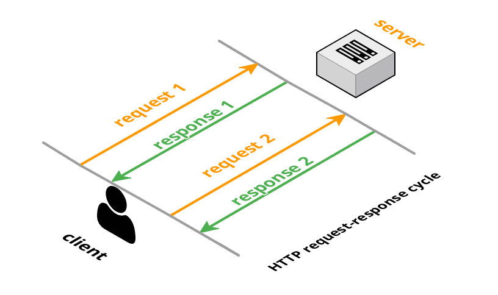
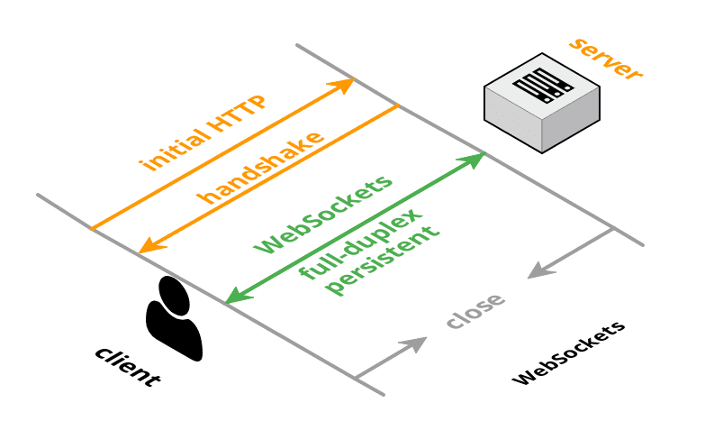

# HTTP



# WebSocket API



Все начинается с HTTP-запроса в котором есть хедер `upgrade`, который уведомляет сервер о том, что клиент хочет установить соединение через вебсокет. Урлы вебсокета используют `ws://` схему (протокол) для HTTP, есть и `wss://` как эквивалент HTTPS.

```bash
GET ws://websocket.example.com/ HTTP/1.1
Origin: http://example.com
Connection: Upgrade
Host: websocket.example.com
Upgrade: websocket
```

Если сервер поддерживает вебсокет, в ответе приходит подтверждение. Это называется `handshake` - рукопожатие.

```bash
HTTP/1.1 101 WebSocket Protocol Handshake
Date: Wed, 16 Oct 2077 11:04:34 GMT
Connection: Upgrade
Upgrade: WebSocket
```

После `рукопожатия`, HTTP-соединение заменяется на WebSocket-соединение которое использует все тот же самый TCP/IP-протокол. После чего клиент и сервер могут отправлять оповещения без ограничений.

Данные передаются в виде `сообщений` (message), каждое из которых состоит из одного или более `кадров` (frame). Каждый кадр сопровождается небольшим отрезком данных содержащих минимальную служебную информацию, чтобы на клиенте кадры можно было собрать в правиьном порядке.
